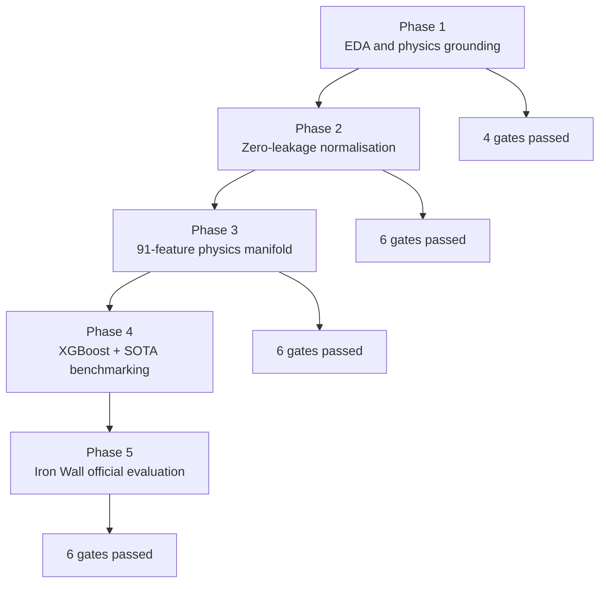
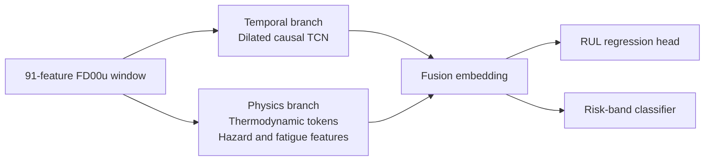
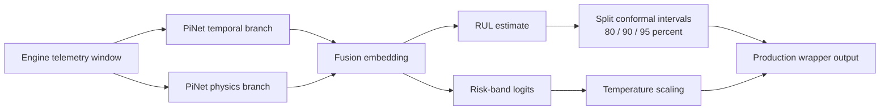
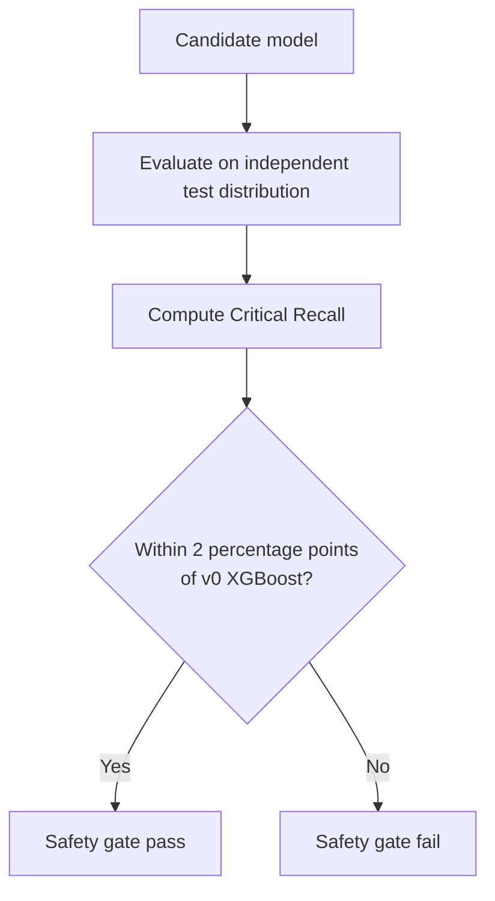
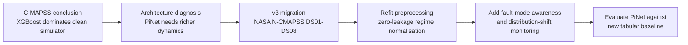

# FusionCore — Physics-Aware Predictive Maintenance Programme

> **Executive summary of the FusionCore turbofan prognostics programme: from physics-grounded feature engineering to PiNet, calibrated uncertainty, and the migration case for NASA N-CMAPSS.**


---

## Executive Summary

**FusionCore** is a three-version aerospace predictive-maintenance research programme built around **Remaining Useful Life (RUL) estimation** for turbofan engines using the NASA C-MAPSS degradation corpus.

The programme asks a deliberately practical question:

> Can a physics-aware, safety-scored machine-learning pipeline identify engines approaching failure early enough to support maintenance scheduling, reduce Aircraft-on-Ground risk, and remain defensible to an engineering audience?

Across the full programme, the strongest validated result is the **FusionCore v0 XGBoost baseline**, trained on a 91-feature physics-aware manifold and evaluated under the **Iron Wall Protocol** on the NASA Official Test Set of 707 engines.

The PiNet neural architecture explored in **v1** and **v2** produced valuable research evidence, but it did **not** outperform the v0 XGBoost reference on C-MAPSS. The programme therefore concludes with a disciplined engineering position:

> **v0 XGBoost is the validated operational research baseline. v1/v2 PiNet remain laboratory architectures. The recommended next step is migration to NASA N-CMAPSS, where richer real-flight dynamics may better justify temporal neural modelling.**

---

> [!WARNING]
> FusionCore is a research and portfolio programme. It is not certified aviation software and must not be used for live dispatch, airworthiness, or maintenance-release decisions without formal verification, validation, safety assurance, and regulatory approval.


## Programme Outcome in One Table

| Version | Purpose | Model Family | Safety Gate | Best Critical Recall | Programme Status |
|---|---|---|---|---:|---|
| **v0** | Build the physics-aware predictive-maintenance baseline | XGBoost + SOTA comparators | Reference | **0.9363** | **Validated baseline** |
| **v1** | Introduce PiNet, a physics-informed temporal neural architecture | TCN + physics branch | FAIL | 0.4204 | Research failure; diagnosed |
| **v2** | Retrain PiNet with mitigations and add calibrated uncertainty | PiNet Stage B + conformal intervals + temperature scaling | FAIL | 0.7834 | Publishable null result |
| **v3 direction** | Test whether PiNet’s architecture is better suited to real-flight telemetry | PiNet on N-CMAPSS | Not started | — | Recommended next programme |

---

## Headline Model Comparison

| Metric | v0 XGBoost | v0 TFT | v0 N-HiTS | v1 PiNet Stage A | v2 PiNet Stage B |
|---|---:|---:|---:|---:|---:|
| RMSE (cycles) | **14.85** | ≈62 | ≈62 | 24.66 | 28.05 |
| MAE (cycles) | **10.41** | ≈49 | ≈49 | 18.83 | 20.57 |
| NASA Asymmetric Score | **4,336** | 10,060,000 | 10,060,000 | 32,204 | 112,334 |
| Critical Recall | **0.9363** | 0.0446 | 0.0446 | 0.4204 | 0.7834 |
| Critical F2 Score | **0.9339** | 0.0532 | 0.0532 | 0.4735 | 0.7716 |
| Critical Precision | **0.9245** | 0.2333 | 0.2333 | 0.9565 | 0.7283 |
| Safety Gate | Reference | FAIL | FAIL | FAIL | FAIL |

### Interpretation

FusionCore v0 remains the only model that clears the programme’s operational safety logic. PiNet v2 recovers substantial recall compared with v1, but its Critical Recall remains approximately **15 percentage points below** v0 XGBoost, and its NASA Asymmetric Score is approximately **25.9× worse** than v0.

The most important conclusion is not simply that XGBoost won. The deeper engineering result is that **C-MAPSS is clean enough for a tabular physics-aware model to dominate**, while PiNet’s temporal capacity is not rewarded strongly enough by this dataset.

---

## Programme Architecture

```mermaid
flowchart LR
    A["Raw NASA C-MAPSS\nFD001-FD004"] --> B["v0 Phase 1\nPhysics audit and EDA"]
    B --> C["v0 Phase 2\nZero-leakage normalisation\nFD00u manifold"]
    C --> D["v0 Phase 3\n91-feature physics manifold"]
    D --> E["v0 Phases 4-5\nXGBoost + SOTA benchmarking\nIron Wall official test"]
    E --> F["v1 PiNet Stage A\nPhysics-informed temporal neural model"]
    F --> G["v2 PiNet Stage B\nMitigated retraining + calibration"]
    G --> H["v3 Recommendation\nMigrate to NASA N-CMAPSS"]

    E:::pass
    F:::fail
    G:::null
    H:::future

    classDef pass fill:#d9ead3,stroke:#38761d,color:#1f3d1f;
    classDef fail fill:#f4cccc,stroke:#990000,color:#4a0000;
    classDef null fill:#fff2cc,stroke:#bf9000,color:#4a3b00;
    classDef future fill:#d9eaf7,stroke:#1f4e79,color:#17365d;
```



---

## What FusionCore Demonstrates

FusionCore is not just a modelling exercise. It is a full aerospace-style analytics programme with explicit attention to **data leakage, physical plausibility, operational risk, model auditability, and safety-weighted evaluation**.

### Core capabilities demonstrated

| Capability | Evidence within FusionCore |
|---|---|
| Physics-grounded EDA | Sensor variance audit, dead-sensor identification, lifecycle trajectories, ACF/PACF degradation memory analysis |
| Zero-leakage preprocessing | Group-level engine split, frozen K-Means regime assignment, per-regime z-score normalisation, Iron Wall official test protocol |
| Physics-aware feature engineering | 91-feature matrix with kinematics, rolling statistics, virtual thermodynamic sensors, fatigue indices, fault-family flags, regime one-hot encoding |
| Aerospace safety scoring | NASA Asymmetric Score, Critical-band recall, Critical precision, F2 score, operational banding into Healthy / Warning / Critical |
| Model forensic audit | SHAP attribution, target-null leakage test, physical perturbation reactivity test, architecture-level disqualification of invalid comparators |
| Neural architecture research | PiNet temporal branch, physics branch, fusion embedding, risk-band classifier, multi-objective training, conformal intervals, temperature scaling |
| Honest negative-result reporting | v1 and v2 PiNet failures are treated as engineering evidence, not hidden or reframed as wins |

---

## Dataset

FusionCore v0, v1, and v2 are built on the **NASA C-MAPSS** turbofan degradation benchmark.

| Subset | Fault Mode | Operating Regimes | Training Engines | Test Engines | Diagnostic Role |
|---|---|---:|---:|---:|---|
| FD001 | Single fault: HPC degradation | 1 | 100 | 100 | Controlled baseline |
| FD002 | Single fault: HPC degradation | 6 | 260 | 259 | Multi-regime single-fault test |
| FD003 | Dual fault: HPC + fan degradation | 1 | 100 | 100 | Single-regime dual-fault stress case |
| FD004 | Dual fault: HPC + fan degradation | 6 | 249 | 248 | Full multi-regime dual-fault stress case |

The programme uses C-MAPSS because it provides complete run-to-failure trajectories, enabling supervised RUL estimation and safety-scored benchmarking. Its limitation is also central to the final conclusion: **C-MAPSS is a simulator with discrete regimes and relatively clean degradation signatures**, which may favour well-engineered tabular models over temporal deep learning.

---

## FusionCore v0 — Validated Physics-Aware Baseline

FusionCore v0 is the foundation of the programme. It builds a complete predictive-maintenance pipeline from raw C-MAPSS telemetry to official-test evaluation.

### v0 phase structure



### v0 core outputs

| Area | Result |
|---|---|
| Corpus size | 160,359 training cycle observations across 709 engines |
| Official test set | 707 held-out engines, opened once under Iron Wall Protocol |
| Feature matrix | 91 physics-aware features |
| Best model | XGBoost |
| Official RMSE | **14.85 cycles** |
| Official NASA Score | **4,336.3** |
| Critical Recall | **0.9363** |
| Critical Precision | **0.9245** |
| Critical F2 | **0.9339** |
| Financial projection | Approximately **USD 13.8M** net annual saving per 100-aircraft fleet under model-driven assumptions |

### Why v0 matters

v0 proves that a carefully engineered physics-aware tabular pipeline can outperform larger neural architectures on C-MAPSS. The key was not model complexity; it was disciplined feature construction, leakage control, safety-weighted scoring, and forensic validation.

---

## FusionCore v1 — PiNet Stage A

FusionCore v1 introduced **PiNet**, a physics-informed neural architecture designed to test whether temporal modelling could improve over the v0 XGBoost baseline.

### PiNet Stage A architecture



### v1 outcome

| Metric | v0 XGBoost Reference | v1 PiNet Stage A | Change |
|---|---:|---:|---:|
| RMSE | **14.85** | 24.66 | +9.81 worse |
| MAE | **10.41** | 18.83 | +8.42 worse |
| NASA Score | **4,336** | 32,204 | 7.4× worse |
| Critical Recall | **0.9363** | 0.4204 | −0.5159 |
| Critical F2 | **0.9339** | 0.4735 | −0.4604 |

### v1 diagnosis

The v1 model failed the Critical-Recall Safety Gate. The post-mortem identified four main failure mechanisms:

| Failure mechanism | Stage A issue | Stage B correction planned for v2 |
|---|---|---|
| Excessive learning rate | `1e-3` caused early over-shooting | Reduce to `3e-4` |
| Insufficient regularisation | Dropout `0.15` too weak | Increase dropout to `0.25` |
| Distribution mismatch | Stratified sampler over-represented Critical examples | Use natural distribution with class-weighted CE |
| Regression-gradient dominance | NASA regression term overwhelmed classification gradient | Scale NASA loss by factor `1/50` |

The v1 lesson is important: a strong embedding geometry is not enough. A model can separate internal representations yet still fail at the operational decision boundary that matters most: catching genuinely Critical engines.

---

## FusionCore v2 — Probabilistic PiNet and Publishable Null Result

FusionCore v2 retrains PiNet under the four Stage B mitigations and adds post-hoc uncertainty quantification:

1. **Split conformal prediction intervals** for RUL.
2. **Temperature scaling** for calibrated Healthy / Warning / Critical probabilities.
3. **Production-style inference wrapper** returning a structured decision object.

### v2 architecture extension



### v2 outcome

| Metric | v0 XGBoost | v1 Stage A | v2 Stage B | v2 vs v0 |
|---|---:|---:|---:|---:|
| RMSE | **14.85** | 24.66 | 28.05 | +13.20 worse |
| NASA Score | **4,336** | 32,204 | 112,334 | 25.9× worse |
| Critical Recall | **0.9363** | 0.4204 | 0.7834 | −0.1529 |
| Critical F2 | **0.9339** | 0.4735 | 0.7716 | −0.1623 |
| Critical Precision | **0.9245** | 0.9565 | 0.7283 | −0.1962 |

v2 is therefore a **salvage success** relative to v1, but a **safety-gate failure** relative to v0.

### v2 per-subset diagnosis

| Subset | Fault Mode | Regime | RMSE | NASA Score | Critical Recall | Share of pooled NASA |
|---|---|---|---:|---:|---:|---:|
| FD001 | Single | Single | 23.32 | 3,553 | 0.640 | 3.2% |
| FD002 | Single | Multi | 24.04 | 2,600 | **0.983** | 2.3% |
| FD003 | Dual | Single | **44.12** | **93,873** | **0.400** | **83.6%** |
| FD004 | Dual | Multi | 25.21 | 12,308 | 0.769 | 11.0% |

The decisive failure is **FD003**: single-regime, dual-fault degradation. It contributes only 100 of the 707 test engines but accounts for **83.6% of the pooled NASA score**. This indicates that PiNet’s architecture still lacks sufficient **fault-mode disambiguation**, especially where regime variation cannot help separate operating-state effects from degradation-state effects.

---

## Safety Gate Logic

FusionCore uses Critical-band recall as the binding safety metric because the most consequential failure mode is clearing an engine that is actually close to failure.

| Operational Band | RUL Range | Meaning | Maintenance Action |
|---|---:|---|---|
| Healthy | 60-125 cycles | Normal operating margin | Continue monitoring |
| Warning | 30-60 cycles | Emerging maintenance window | Prepare parts, slot, and inspection |
| Critical | 0-30 cycles | AOG / urgent maintenance risk | Immediate maintenance escalation |

The programme’s acceptance logic is:



Under this rule:

- v0 XGBoost is the reference at **0.9363** Critical Recall.
- v1 PiNet fails at **0.4204**.
- v2 PiNet fails at **0.7834**.

---

## Financial Interpretation

The programme uses a consistent fleet-level financial model for like-for-like comparison across model variants. The financial model rewards avoided Unscheduled Engine Removals (UERs), penalises false alerts, and reflects the asymmetry between missed failures and unnecessary maintenance.

| Model | UERs Avoided | UER Savings | False Alerts | False-Alert Cost | Net Saving per 100-Aircraft Fleet |
|---|---:|---:|---:|---:|---:|
| **v0 XGBoost** | 9.36 | USD 14.04M | 0.75 | USD 0.22M | **USD 13.82M** |
| v1 PiNet Stage A | 4.20 | USD 6.31M | 0.19 | USD 0.06M | USD 6.25M |
| v2 PiNet Stage B | 7.83 | USD 11.75M | 2.91 | USD 0.87M | USD 10.88M |
| v0 TFT | 0.45 | USD 0.67M | 7.67 | USD 2.30M | −USD 1.63M |
| v0 N-HiTS | 0.45 | USD 0.67M | 7.67 | USD 2.30M | −USD 1.63M |

### Financial lesson

v2 recovers approximately **USD 4.6M** per annum relative to v1, mainly through recall recovery. The remaining gap to v0 is driven largely by **Critical precision**, not recall alone. Future work should therefore treat precision restoration as a first-class financial objective, not merely a secondary classification statistic.

---

## Main Engineering Lessons

### 1. Physics-aware tabular models are extremely strong on C-MAPSS

The v0 XGBoost model exploits a carefully engineered 91-feature manifold more effectively than larger temporal architectures. On this dataset, strong physics features plus gradient boosting outperform raw temporal modelling.

### 2. Distribution shift dominates post-hoc calibration

Split conformal intervals and temperature scaling perform well on internal validation but degrade on the NASA Official Test Set. The issue is not the mathematics of calibration; it is the violation of exchangeability between calibration data and truncated test trajectories.

### 3. Internal validation is not enough

At every stage, validation metrics were materially better than final test metrics. Acceptance gates must therefore be placed on genuinely independent evaluation distributions, not on partitions used for tuning or calibration.

### 4. Dual-fault single-regime engines expose the architectural weakness

FD003 is the decisive subset for PiNet v2 failure. The model struggles where dual-fault dynamics exist without regime diversity to help contextualise the degradation signal.

### 5. PiNet requires richer operational variation

PiNet’s temporal and regime-aware branches are likely under-utilised by C-MAPSS. NASA N-CMAPSS offers continuous flight-envelope variation and more realistic telemetry complexity, making it the appropriate next testbed.

---

## Recommended Next Step: FusionCore v3 on N-CMAPSS

The recommended v3 programme is not another C-MAPSS retraining loop. It is a dataset migration and architectural stress test.



### v3 design priorities

| Priority | Rationale |
|---|---|
| Migrate to N-CMAPSS | Richer, more realistic flight envelopes and degradation behaviour |
| Add fault-mode awareness | FD003 shows dual-fault ambiguity is the dominant PiNet weakness |
| Refit all preprocessing under zero-leakage discipline | N-CMAPSS requires dataset-specific normalisation, feature calibration, and uncertainty analysis |
| Use independent evaluation gates | Avoid accepting validation-distribution performance as operational evidence |
| Add distribution-shift detection | Calibration is only meaningful when deployment data resembles calibration data |

---

## Suggested Repository Structure

```text
FusionCore/
├── README.md
├── docs/
│   ├── executive/
│   │   ├── FusionCore_Programme_Summary.pdf
│   │   ├── FusionCore_v0_Executive_Technical_Report.pdf
│   │   ├── FusionCore_v1_Stakeholder_Report.pdf
│   │   └── FusionCore_v2_Stakeholder_Report.pdf
│   ├── technical/
│   │   ├── Phase1_Technical_Analysis.pdf
│   │   ├── Phase2_Technical_Analysis.pdf
│   │   ├── Phase3_Technical_Analysis.pdf
│   │   └── Phase4_Phase5_Technical_Analysis.pdf
│   └── style/
│       └── FUSIONCORE_DOC_STYLE_v1_4.md
├── notebooks/
│   ├── v0/
│   │   ├── 01_eda_physics_grounding.ipynb
│   │   ├── 02_zero_leakage_normalisation.ipynb
│   │   ├── 03_physics_feature_engineering.ipynb
│   │   ├── 04_xgboost_and_sota_benchmarking.ipynb
│   │   └── 05_iron_wall_evaluation.ipynb
│   ├── v1/
│   │   └── pinet_stage_a_training_and_evaluation.ipynb
│   └── v2/
│       ├── stage_b_retraining.ipynb
│       ├── conformal_uncertainty.ipynb
│       ├── temperature_scaling.ipynb
│       └── iron_wall_wrapper_evaluation.ipynb
├── src/
│   ├── preprocessing/
│   ├── features/
│   ├── models/
│   ├── calibration/
│   └── evaluation/
├── artefacts/
│   ├── frozen_regime_dictionary/
│   ├── feature_manifest/
│   ├── trained_models/
│   └── calibration_objects/
├── reports/
│   ├── figures/
│   └── tables/
└── requirements.txt
```

---

## What to Read First

| Reader | Recommended path |
|---|---|
| Recruiter / hiring manager | Read this README, then the Programme Summary |
| Aerospace / PHM reviewer | Read v0 Executive Report, then Phase 4/5 Technical Analysis |
| Data scientist / ML engineer | Read Phase 2, Phase 3, and v2 Stakeholder Report |
| Neural architecture reviewer | Read v1 Stakeholder Report and v2 Stakeholder Report |
| Future project contributor | Read the v3 migration recommendation and the open items table |

---

## Source Document Register

This README summarises the following internal FusionCore documents:

| Document | Role |
|---|---|
| `FusionCore_Programme_Summary.docx` | Programme-level conclusion across v0, v1, and v2 |
| `FusionCore_v0_Executive_Technical_Report.docx` | Executive summary of the completed v0 five-phase pipeline |
| `Phase1_Technical_Analysis.docx` | Physics audit, EDA, sensor variance, temporal memory |
| `Phase2_Technical_Analysis.docx` | Zero-leakage normalisation and FD00u construction |
| `Phase3_Technical_Analysis.docx` | 91-feature physics-aware manifold and survival analysis |
| `Phase4_Phase5_Technical_Analysis.docx` | Model benchmarking, forensic audit, official evaluation, financial projection |
| `FusionCore_v1_Stakeholder_Report.docx` | PiNet Stage A results and failure diagnosis |
| `FusionCore_v2_Stakeholder_Report.docx` | Stage B retraining, conformal intervals, temperature scaling, final v2 evaluation |
| `FusionCore_v1_Master_Roadmap.docx` | PiNet architecture and execution roadmap |
| `FUSIONCORE_DOC_STYLE_v1_4.md` | Documentation and formatting standard |

---

## Final Position

FusionCore produces a clear, defensible, and useful outcome:

> **The most operationally credible model on NASA C-MAPSS is the v0 physics-aware XGBoost baseline. PiNet v1/v2 do not supersede it on this dataset, but they generate a valuable diagnosis for future PHM research: temporal physics-informed architectures require richer operating envelopes, explicit fault-mode awareness, and distribution-aware calibration.**

This is a stronger result than an unsupported model win. It shows a complete engineering workflow: build the baseline, challenge it, audit the failure, quantify the operational impact, and define the next experiment on stronger evidence.

