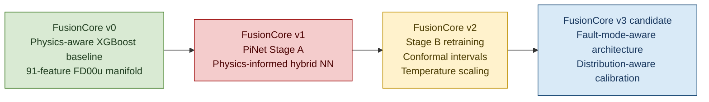
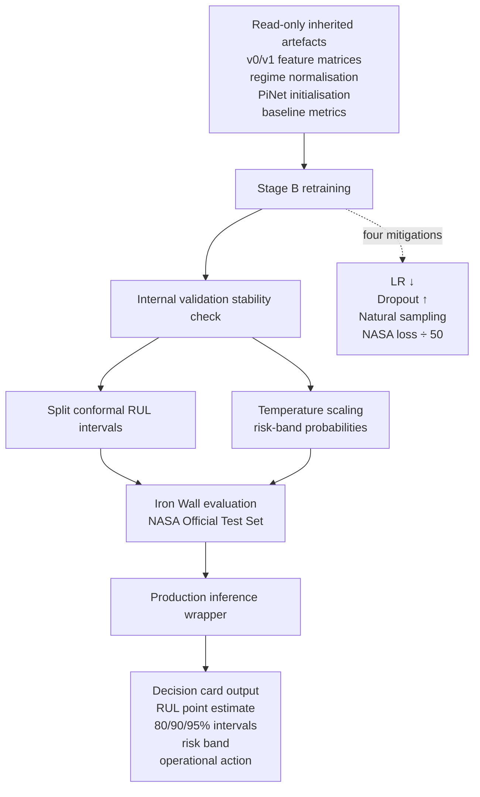
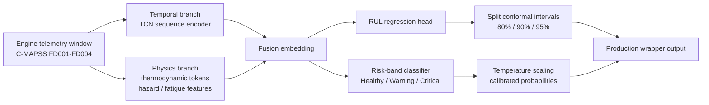
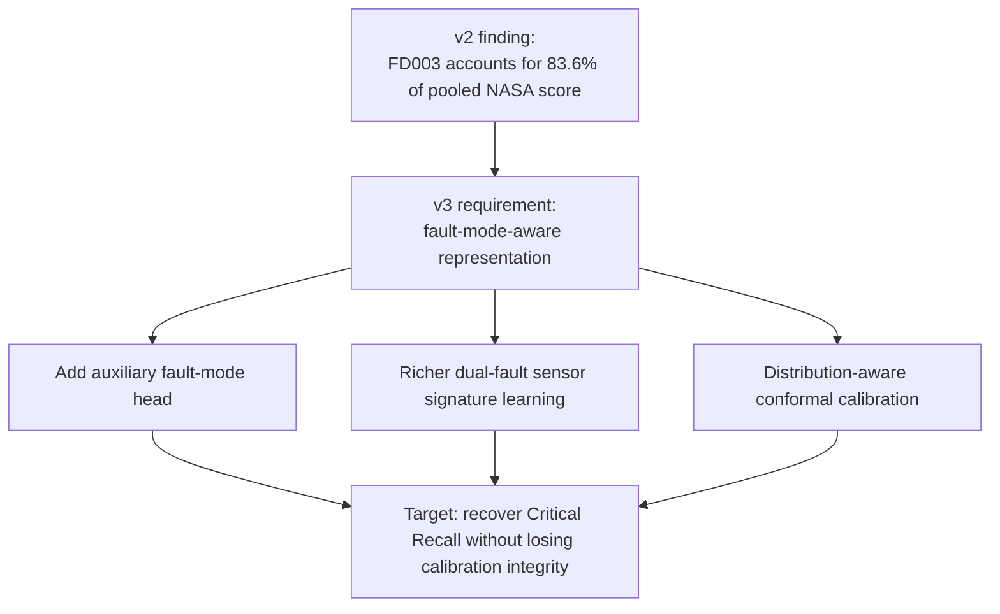

# FusionCore v2 — Probabilistic Predictive Maintenance

> **Stage B retraining, calibrated uncertainty, and production-wrapper evidence for PiNet on NASA C-MAPSS turbofan RUL estimation.**


---

## Executive Summary

**FusionCore v2** is the probabilistic extension of the FusionCore turbofan predictive-maintenance programme. It evaluates whether the failed **FusionCore v1 PiNet Stage A** model can be recovered through targeted Stage B retraining and whether uncertainty can be attached to each Remaining Useful Life prediction using post-hoc calibration.

The programme has two coupled objectives:

1. **Salvage:** retrain PiNet using the four Stage B mitigations derived from the v1 post-mortem.
2. **Calibration:** attach distribution-free conformal prediction intervals to the RUL regressor and temperature-scaled probabilities to the three-class operational risk-band classifier.

The result is a **scientifically useful but operationally failed model**. Stage B substantially improves Critical-band recall compared with v1 Stage A, but it does **not** reach the v0 XGBoost safety baseline. The v0 XGBoost model remains the only validated operational reference model.

> [!IMPORTANT]
> **FusionCore v2 is a publishable null result, not a deployment candidate.**  
> It improves over v1 Stage A, produces a structured uncertainty wrapper, and diagnoses the main failure mode, but it fails the Critical-Recall Safety Gate against the v0 XGBoost baseline.

---

## Headline Outcome

| Metric | v0 XGBoost reference | v1 Stage A | v2 PiNet | v2 vs v0 |
|---|---:|---:|---:|---:|
| RMSE | **14.85** | 24.66 | 28.05 | +13.20 worse |
| MAE | **10.41** | 18.83 | 20.57 | +10.16 worse |
| NASA Asymmetric Score | **4,336** | 32,204 | 112,334 | 25.9× worse |
| Critical Recall | **0.9363** | 0.4204 | 0.7834 | −0.1529 |
| Critical F2 Score | **0.9339** | 0.4735 | 0.7716 | −0.1623 |
| Critical Precision | **0.9245** | 0.9565 | 0.7283 | −0.1962 |
| Safety Gate | **Reference** | FAIL | **FAIL** | — |
| Salvage vs v1 Stage A | Reference | Baseline | **+0.3630 recall** | PASS |

### Interpretation

FusionCore v2 succeeds as a **salvage experiment** but fails as a **safety-critical replacement** for v0. Critical Recall improves from **0.4204** to **0.7834**, confirming that the Stage B mitigations were correctly targeted. However, v2 remains **0.1529 below** the v0 XGBoost Critical Recall of **0.9363**, well outside the permitted two-percentage-point safety tolerance.

---

## Programme Lineage



| Version | Role | Outcome |
|---|---|---|
| **v0** | Physics-aware XGBoost benchmark on the 91-feature FD00u manifold | Operational reference model; safety gate passed |
| **v1** | PiNet Stage A hybrid neural architecture | Safety gate failed; post-mortem identified four retraining mitigations |
| **v2** | PiNet Stage B retraining plus calibrated uncertainty wrapper | Salvage improved recall; safety gate still failed; uncertainty wrapper produced |
| **v3 direction** | Fault-mode-aware PiNet with distribution-aware calibration | Recommended next research direction |

---

## What FusionCore v2 Adds

FusionCore v2 does **not** restart preprocessing. It inherits the validated FusionCore artefacts on a read-only basis and concentrates on model salvage, uncertainty quantification, and operational decision packaging.



### Stage B Mitigations

| Diagnosed v1 Stage A issue | Stage A setting | Stage B correction | Purpose |
|---|---:|---:|---|
| Excessive learning rate | `1e-3` | `3e-4` | Slower descent; avoid early over-shooting |
| Insufficient temporal regularisation | Dropout `0.15` | Dropout `0.25` | Widen the validation plateau |
| Train/test distribution mismatch | Stratified `45:27.5:27.5` sampling | Natural distribution + class-weighted CE | Match evaluation proportions while preserving class signal |
| Regression gradient dominance | NASA term unscaled | NASA term scaled by `1/50` | Balance regression and classification gradients |

---

## Model and Calibration Architecture

At v2, PiNet remains a physics-informed neural RUL model with two principal output paths: a regression head for Remaining Useful Life and a classifier head for operational band assignment.



### Output Contract

The v2 production wrapper is designed to return a structured operational decision object:

| Field | Type | Description |
|---|---|---|
| `rul_point_estimate` | float | PiNet Remaining Useful Life prediction in cycles |
| `pi_95` | pair `[lo, hi]` | 95% conformal prediction interval, clipped to physical bounds |
| `pi_90` | pair `[lo, hi]` | 90% conformal prediction interval |
| `pi_80` | pair `[lo, hi]` | 80% conformal prediction interval |
| `risk_band_id` | integer | `0 = Healthy`, `1 = Warning`, `2 = Critical` |
| `risk_band_label` | string | Human-readable operational band |
| `risk_band_probabilities` | vector length 3 | Temperature-scaled SoftMax probabilities |
| `recommended_action` | string | Maintenance action derived from risk band and interval boundaries |

---

## Dataset

FusionCore v2 is evaluated on the **NASA C-MAPSS turbofan degradation corpus**, across all four standard subsets.

| Subset | Fault mode | Operating regime | Role in diagnosis |
|---|---|---|---|
| FD001 | Single fault | Single regime | Controlled single-fault baseline |
| FD002 | Single fault | Six regimes | Best v2 subset; strong Critical recall |
| FD003 | Dual fault | Single regime | Principal v2 failure mode |
| FD004 | Dual fault | Six regimes | Dual-fault multi-regime stress test |

The official test set remains protected by the **Iron Wall Protocol**: the model, conformal intervals, and temperature scalar are fitted before opening the NASA Official Test Set, and no retraining is permitted after test metrics are observed.

---

## Per-Subset Result

The pooled failure is not evenly distributed. FD003 dominates the NASA penalty and explains why v2 fails the safety gate.

| Subset | Fault mode | Regime | Engines | RMSE | NASA Score | Critical F2 | Critical Recall | Share of pooled NASA |
|---|---|---|---:|---:|---:|---:|---:|---:|
| FD001 | Single | Single | 100 | 23.32 | 3,553 | 0.684 | 0.640 | 3.2% |
| FD002 | Single | Multi | 259 | 24.04 | 2,600 | 0.889 | **0.983** | 2.3% |
| FD003 | Dual | Single | 100 | **44.12** | **93,873** | **0.455** | **0.400** | **83.6%** |
| FD004 | Dual | Multi | 248 | 25.21 | 12,308 | 0.769 | 0.769 | 11.0% |

### FD003 Diagnosis

FD003 is the structural bottleneck. It combines **single-regime operation** with **dual-fault degradation**, meaning the model cannot rely on regime variation to separate operating-state effects from degradation-state effects. The model must infer intra-family fault structure from sensor evolution alone. v2 does not contain an explicit fault-mode identification head, so dual-fault ambiguity remains unresolved.

This is the primary v3 design signal: **the next architecture should be fault-mode-aware rather than simply better regularised.**

---

## Calibration Results

### Split Conformal RUL Intervals

Split conformal prediction succeeds on the internal validation distribution but fails to transfer to the NASA Official Test Set. This is not a failure of conformal theory; it is evidence that the calibration and test distributions are not exchangeable.

#### Internal Validation

| Nominal coverage | Half-width | Calibration coverage | Evaluation-slice coverage |
|---:|---:|---:|---:|
| 95% | 31.54 cycles | 0.9501 | 0.9475 |
| 90% | 25.21 cycles | 0.9001 | 0.8986 |
| 80% | 18.28 cycles | 0.8001 | 0.7983 |

#### NASA Official Test Set

| Nominal coverage | Observed test coverage | Coverage deficit |
|---:|---:|---:|
| 95% | 0.767 | −0.183 |
| 90% | 0.693 | −0.207 |
| 80% | 0.567 | −0.233 |

### Temperature Scaling

Temperature scaling works on the internal validation distribution but transfers only weakly to the test set.

| Metric | Before scaling | After scaling |
|---|---:|---:|
| Internal calibration ECE | 0.0234 | **0.0068** |
| Internal evaluation ECE | 0.0269 | **0.0105** |
| Test ECE | 0.201 | 0.177 |
| Test Brier Score | 0.499 | 0.479 |

### Key Calibration Lesson

Post-hoc calibration can correct **probability shape** when the calibration distribution matches the target distribution. It cannot rescue a model that does not generalise structurally from run-to-failure training trajectories to the truncated NASA test trajectories.

---

## Operational Meaning

The central aviation-maintenance metric is **Critical-band recall**: the fraction of genuinely near-failure engines correctly flagged in time. In this programme:

- v0 XGBoost catches **93.63%** of critical engines.
- v1 Stage A catches **42.04%**.
- v2 PiNet catches **78.34%**.

v2 therefore recovers substantial safety signal but still misses too many critical engines to be trusted for operational dispatch or maintenance planning.

> [!WARNING]
> **No v2 output should be used for operational decision-making.**  
> v2 is useful as research evidence, calibration infrastructure, and v3 design guidance.

---

## Recommended Repository Structure

```text
FusionCore-v2/
├── README.md
├── data/
│   ├── raw/                         # NASA C-MAPSS files, not committed if licence-restricted
│   ├── interim/                     # inherited v0/v1 matrices and split artefacts
│   └── processed/                   # v2-ready tensors / evaluation outputs
├── notebooks/
│   ├── 01_stage_b_retraining.ipynb
│   ├── 02_conformal_intervals.ipynb
│   ├── 03_temperature_scaling.ipynb
│   ├── 04_iron_wall_test_evaluation.ipynb
│   └── 05_production_wrapper_demo.ipynb
├── src/
│   ├── data/
│   ├── models/
│   ├── calibration/
│   ├── evaluation/
│   └── inference/
├── models/
│   ├── checkpoints/
│   └── calibration/
├── reports/
│   ├── figures/
│   └── FusionCore_v2_Stakeholder_Report.docx
├── requirements.txt
└── pyproject.toml
```

If the live repository already uses different notebook names, retain the actual project filenames and use this structure as the README navigation model rather than as a forced refactor.

---

## Reproducibility Outline

1. Install Python dependencies.
2. Place NASA C-MAPSS source files under `data/raw/` or provide inherited v0/v1 processed artefacts under `data/interim/`.
3. Run the Stage B retraining notebook/script.
4. Fit conformal interval half-widths on the internal calibration slice.
5. Fit the temperature scalar on the classification calibration logits.
6. Open the NASA Official Test Set once under the Iron Wall Protocol.
7. Generate pooled metrics, per-subset diagnostics, calibration tables, and production-wrapper examples.

Example command structure:

```bash
python -m src.models.train_stage_b
python -m src.calibration.fit_conformal
python -m src.calibration.fit_temperature
python -m src.evaluation.evaluate_iron_wall
python -m src.inference.demo_decision_cards
```

> The commands above are a recommended interface. Align them with the actual scripts in the repository if the implementation uses notebooks only.

---

## Evaluation Framework

FusionCore v2 uses the same safety-first evaluation doctrine as the earlier FusionCore programme:

| Evaluation dimension | Metric | Operational meaning |
|---|---|---|
| Point estimation | RMSE / MAE | Maintenance planning precision in flight cycles |
| Safety scoring | NASA Asymmetric Score | Penalises late predictions more heavily than early predictions |
| Operational classification | Critical Precision / Recall / F2 | Assesses whether near-failure engines are caught in time |
| Calibration | Conformal coverage / ECE / Brier Score | Measures whether uncertainty outputs can be trusted |
| Subset diagnosis | FD001–FD004 breakdown | Identifies where the model fails physically |

The binding acceptance criterion is the **Critical-Recall Safety Gate**:

```text
v2 Critical Recall must be within 0.02 of v0 XGBoost Critical Recall.

v0 Critical Recall = 0.9363
v2 Critical Recall = 0.7834
Deficit            = 0.1529
Result             = FAIL
```

---

## Forward Path: FusionCore v3

FusionCore v2 points to a clear v3 thesis:

1. Add an explicit **fault-mode identification head** to separate fan degradation, HPC degradation, and compound degradation signatures.
2. Replace standard split conformal calibration with a **distribution-aware method**, such as conformalised quantile regression, localised conformal prediction, or covariate-shift-aware conformal prediction.
3. Treat FD003 as the principal development target rather than an after-the-fact diagnostic subset.
4. Preserve the production wrapper design, but do not promote the v2 wrapper to deployment until the underlying model passes the Critical-Recall Safety Gate.



---

## Key Scientific Contributions

FusionCore v2 contributes the following evidence to the project record:

- Confirms that the four Stage B mitigations recover material Critical-band recall from the failed v1 Stage A model.
- Demonstrates exact conformal coverage in-distribution and exposes the exchangeability failure on the NASA Official Test Set.
- Confirms that temperature scaling corrects mild overconfidence in-distribution but cannot resolve out-of-distribution miscalibration.
- Identifies FD003 as the dominant architectural bottleneck, accounting for **83.6%** of the pooled NASA score.
- Produces a structured production-wrapper output contract suitable for a future dashboard or maintenance decision layer once the model itself becomes operationally credible.

---

## References

1. Saxena, A. et al. (2008). *Turbofan Engine Degradation Simulation Data Set*. NASA Ames Prognostics Data Repository.
2. Vovk, V., Gammerman, A. and Shafer, G. (2005). *Algorithmic Learning in a Random World*. Springer.
3. Lei, J. et al. (2018). Distribution-free predictive inference for regression. *Journal of the American Statistical Association*, 113(523), 1094–1111.
4. Guan, L. (2023). Localized conformal prediction. *Biometrika*, 110(1), 33–50.
5. Guo, C., Pleiss, G., Sun, Y. and Weinberger, K. Q. (2017). On calibration of modern neural networks. *ICML 2017*, 1321–1330.
6. Naeini, M. P., Cooper, G. F. and Hauskrecht, M. (2015). Obtaining well-calibrated probabilities using Bayesian binning. *AAAI 2015*.
7. Romano, Y., Patterson, E. and Candès, E. J. (2019). Conformalised quantile regression. *NeurIPS 2019*.
8. Tibshirani, R. J. et al. (2019). Conformal prediction under covariate shift. *NeurIPS 2019*.
9. Brier, G. W. (1950). Verification of forecasts expressed in terms of probability. *Monthly Weather Review*, 78(1), 1–3.
10. Cox, D. R. (1972). Regression models and life-tables. *Journal of the Royal Statistical Society B*, 34(2), 187–220.

---

## Status Statement

FusionCore v2 should be described publicly as:

> **A probabilistic PiNet salvage-and-calibration study that recovered substantial safety signal from the failed v1 model, proved the calibration wrapper in-distribution, diagnosed FD003 as the dominant dual-fault bottleneck, and concluded that v0 XGBoost remains the only operationally validated FusionCore model.**


